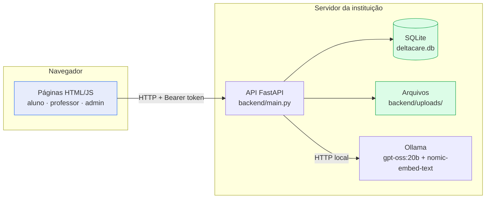
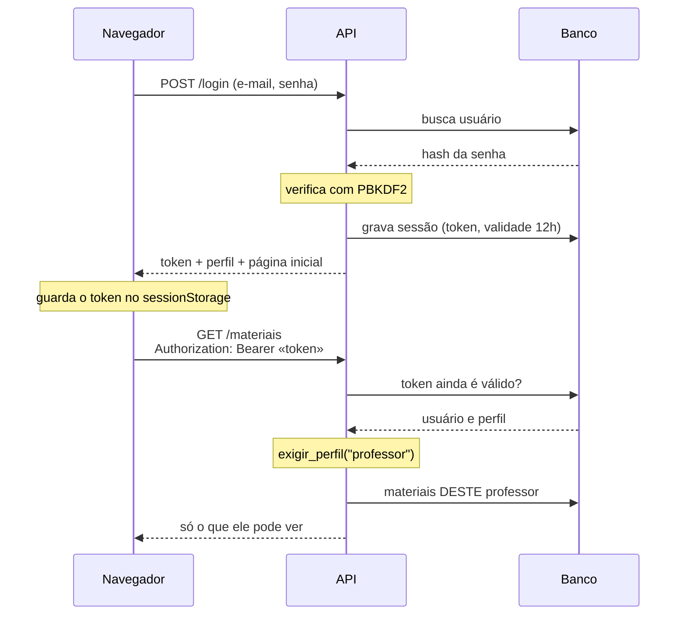
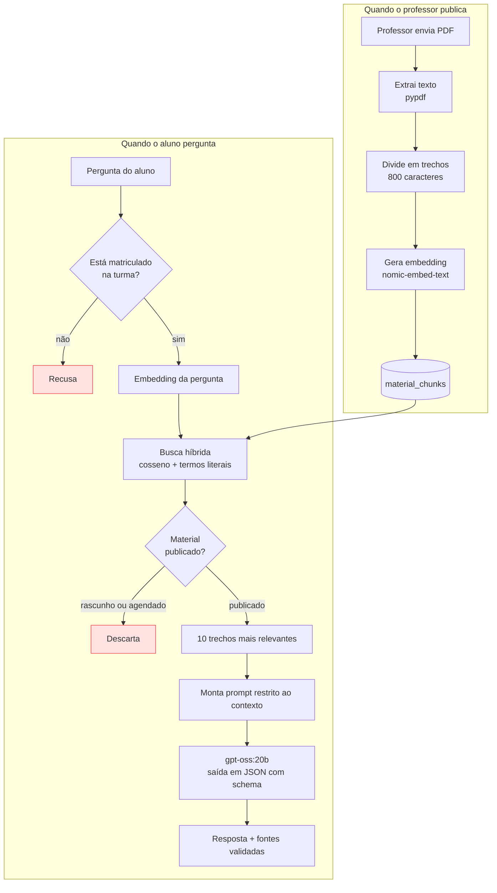
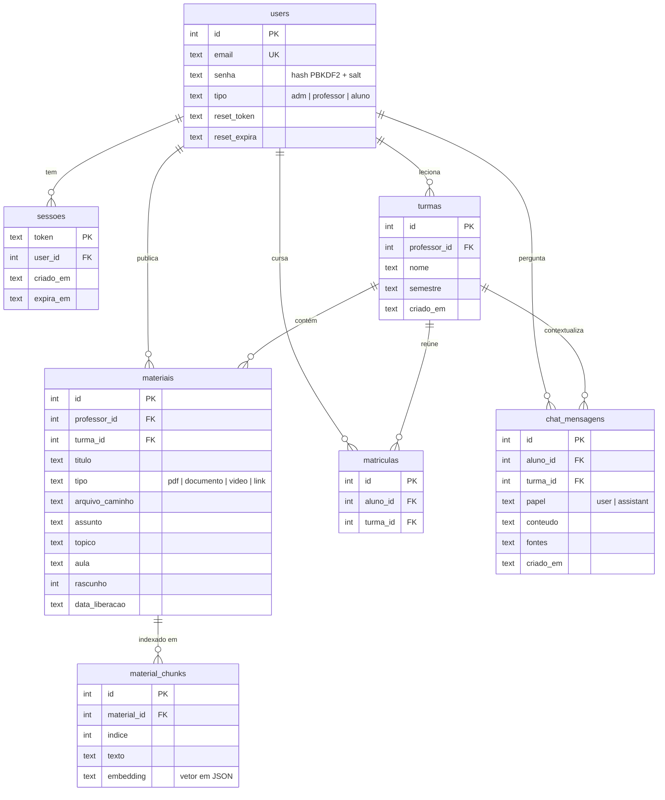

# Arquitetura do Delta Care

Os diagramas estão em Mermaid, que o GitHub renderiza direto na página — não
é preciso abrir nenhuma ferramenta para vê-los.

---

## 1. Visão geral

Três processos independentes. O navegador nunca fala com o banco nem com o
modelo de IA: tudo passa pela API, que é onde as regras de permissão vivem.



**O que não aparece no diagrama, de propósito:** não há seta saindo do
servidor para fora. O modelo de IA roda localmente, então material de aula e
perguntas de aluno não trafegam para serviços de terceiros.

---

## 2. Autenticação

O ponto que mudou o projeto: antes, o backend acreditava no e-mail que o front
enviava em cada requisição — bastava trocar o campo para agir em nome de outra
pessoa. Hoje a identidade vem sempre do token.



Nenhuma rota protegida aceita e-mail vindo do cliente. As duas exceções
(`professor_email` ao criar turma, `aluno_email` ao matricular) são o **alvo**
da ação, não quem a executa, e ambas só existem em rotas de administração.

---

## 3. Chat de IA (RAG)

O fluxo que sustenta o diferencial do produto: o assistente responde apenas
com base no material que o professor liberou.



Dois pontos valem ser explicados numa apresentação:

**A busca é híbrida, não só semântica.** Medindo numa apostila de 18 trechos, o
trecho que definia um escore específico caía para a 7ª posição por similaridade
pura — atrás de trechos que não respondiam nada — porque num trecho de 800
caracteres onde só 80 respondem, o embedding é dominado pelos outros 720.
Somar um bônus para trechos que contêm literalmente os termos distintivos da
pergunta (siglas, códigos, números) levou o trecho certo para a 1ª posição.

**As fontes são validadas pelo sistema, não declaradas pelo modelo.** O schema
JSON passado ao Ollama restringe o decodificador, e o `enum` limita as fontes
aos títulos dos materiais realmente recuperados. O modelo não consegue inventar
uma fonte nem grafar o título de outro jeito.

---

## 4. Modelo de dados



**Sobre o status do material:** não existe coluna `status`. Ele é calculado a
partir de `rascunho` e `data_liberacao` no momento da consulta, porque depende
da hora atual — um material agendado vira publicado sozinho quando a data
chega, sem nenhuma tarefa periódica.

---

## 5. Quem enxerga o quê

```mermaid
graph TD
    ADM["Administrador"] --> ADM1["Cria e exclui turma"]
    ADM --> ADM2["Matricula e desmatricula aluno"]
    ADM --> ADM3["Cria conta de professor e admin"]

    PROF["Professor"] --> P1["Vê apenas as turmas atribuídas a ele"]
    PROF --> P2["Gerencia apenas os próprios materiais"]
    PROF --> P3["Enxerga rascunho e agendado"]

    ALU["Aluno"] --> A1["Vê apenas turmas em que está matriculado"]
    ALU --> A2["Vê apenas material publicado"]
    ALU --> A3["Pergunta só sobre as próprias turmas"]

    classDef adm fill:#E7ECFB,stroke:#2F70F2
    classDef prof fill:#DCFCE7,stroke:#16A34A
    classDef alu fill:#FEF3C7,stroke:#F59E0B
    class ADM,ADM1,ADM2,ADM3 adm
    class PROF,P1,P2,P3 prof
    class ALU,A1,A2,A3 alu
```



A visão do professor e a do aluno vivem em módulos separados
(`regras/materiais.py` e `regras/aluno.py`) exatamente porque diferem: a do
professor inclui rascunho e agendado. Misturar as duas na mesma função com um
parâmetro de filtro seria um convite a errar e vazar material não liberado.

Todas essas regras são verificadas no servidor e cobertas pelos testes em
[`backend/testes.py`](backend/testes.py).

---

## 6. Organização do código

```
backend/
  main.py                  - API FastAPI: rotas e dependências de autenticação
  seed_demo.py             - cria os dados de demonstração
  testes.py                - 43 testes (rodam sem o Ollama)

  infra/                   - infraestrutura: o que o sistema USA
    database.py              schema e caminho único do banco
    security.py              hash de senha (PBKDF2, sem dependência externa)
    sessoes.py               token de sessão
    arquivos.py              gravação dos uploads

  regras/                  - regras de negócio: o que o sistema DECIDE
    autenticacao.py          login, cadastro, recuperação de senha
    turmas.py                turmas, professores, usuários
    materiais.py             materiais na visão do PROFESSOR
    aluno.py                 materiais na visão do ALUNO
    matriculas.py            matrículas
    chat_ia.py               RAG: indexação, busca híbrida, resposta
```

A separação entre `infra/` e `regras/` responde a uma pergunta simples: o
módulo descreve algo que o sistema **usa** (banco, hash, arquivo) ou algo que
ele **decide** (quem vê o quê, o que é material publicado)? Nenhum módulo de
`regras/` importa FastAPI — é o que permite testá-los direto, sem subir
servidor, e o que permitiria trocar a camada HTTP sem reescrever as regras.
