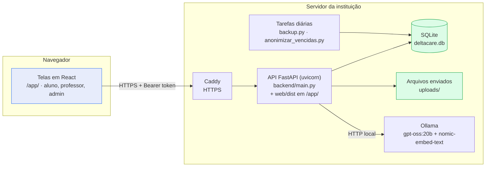
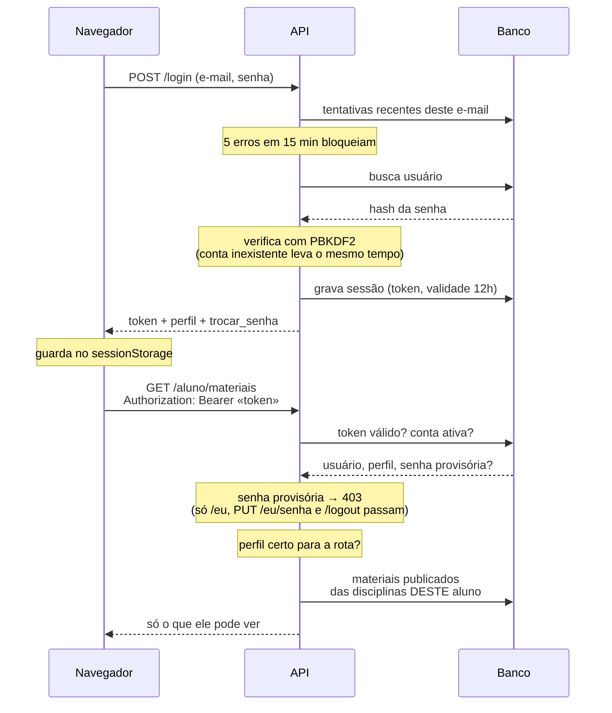
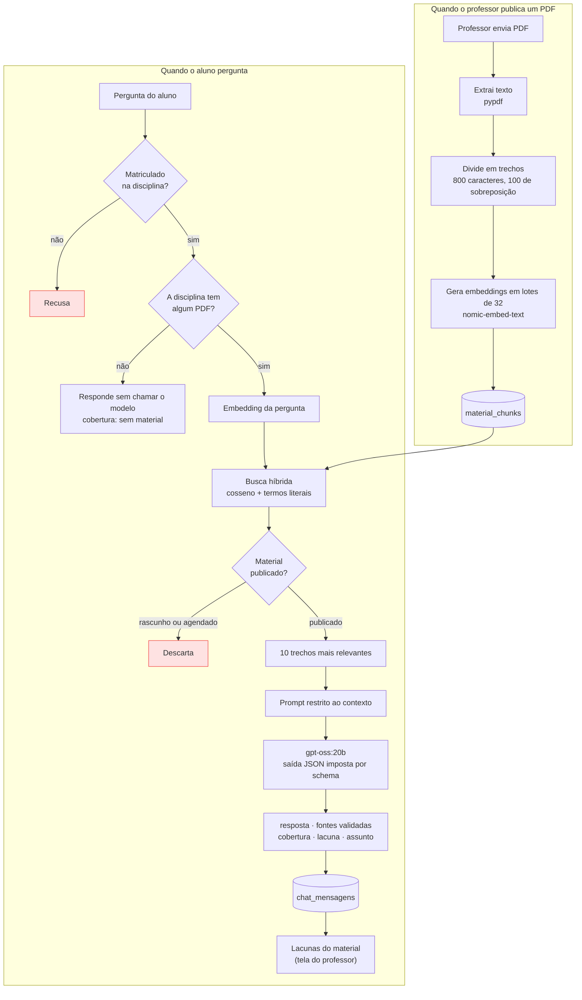
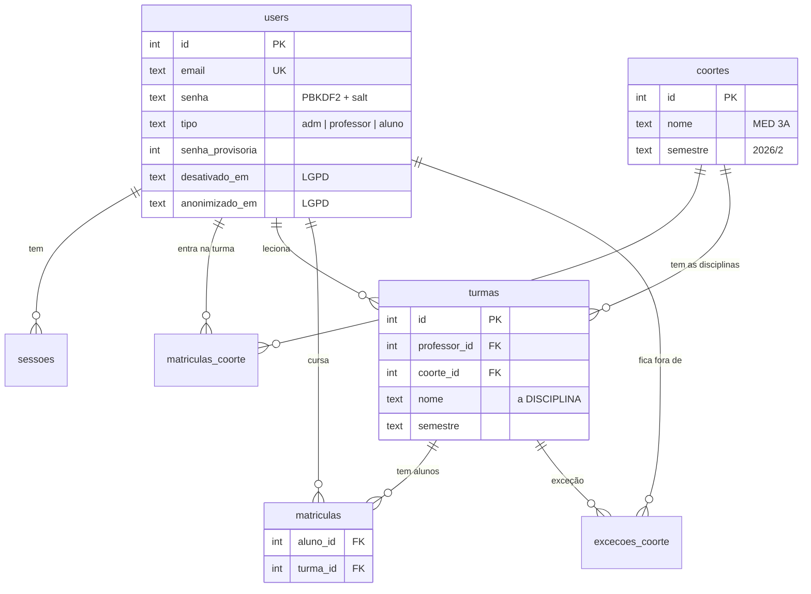
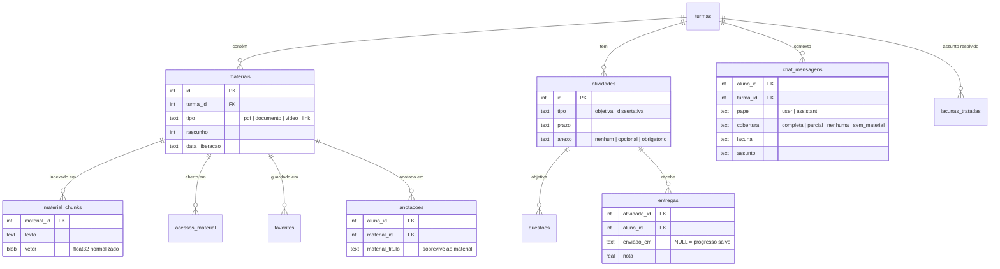
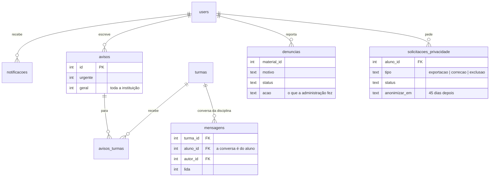
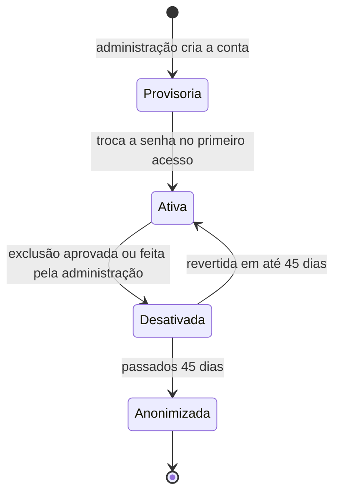
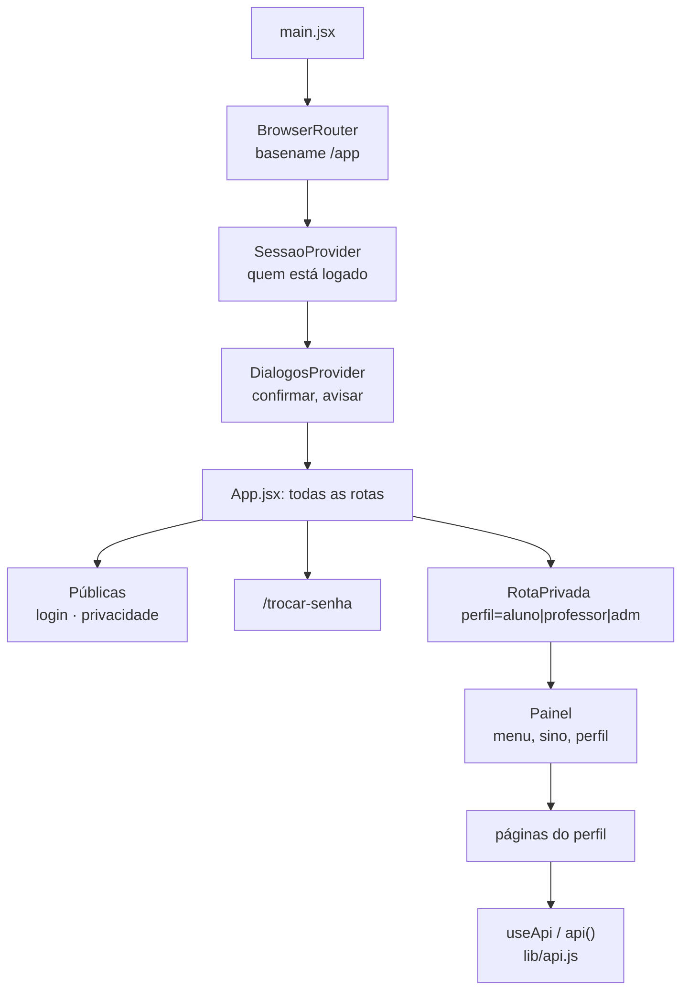

# Arquitetura do Delta Care

Os diagramas estão em Mermaid, que o GitHub renderiza direto na página — não
é preciso abrir nenhuma ferramenta para vê-los.

---

## 1. Visão geral

Um processo serve a API **e** as telas. O navegador nunca fala com o banco
nem com o modelo de IA: tudo passa pela API, que é onde as regras de
permissão vivem.


```mermaid
graph LR
    subgraph Navegador
        UI["Telas em React<br/>/app/ · aluno, professor, admin"]
    end

    subgraph "Servidor da instituição"
        CAD["Caddy<br/>HTTPS"]
        API["API FastAPI (uvicorn)<br/>backend/main.py<br/>+ web/dist em /app/"]
        DB[("SQLite<br/>deltacare.db")]
        FS["Arquivos enviados<br/>uploads/"]
        OLL["Ollama<br/>gpt-oss:20b + nomic-embed-text"]
        CRON["Tarefas diárias<br/>backup.py · anonimizar_vencidas.py"]
    end

    UI -->|"HTTPS + Bearer token"| CAD
    CAD --> API
    API --> DB
    API --> FS
    API -->|"HTTP local"| OLL
    CRON --> DB

    classDef externo fill:#E7ECFB,stroke:#2F70F2
    classDef dados fill:#DCFCE7,stroke:#16A34A
    class UI externo
    class DB,FS dados
```

**O que não aparece no diagrama, de propósito:** não há seta saindo do
servidor para fora (a não ser o e-mail de recuperação de senha, pelo SMTP da
instituição). O modelo de IA roda localmente, então material de aula e
perguntas de aluno não trafegam para serviços de terceiros.

**As telas exigem a API no ar.** Não há modo de contingência com dado de
exemplo: se o servidor não responde, a tela diz isso e para.

---

## 2. Autenticação

O ponto que mudou o projeto: antes, o backend acreditava no e-mail que o front
enviava em cada requisição — bastava trocar o campo para agir em nome de outra
pessoa. Hoje a identidade vem sempre do token.


```mermaid
sequenceDiagram
    participant N as Navegador
    participant A as API
    participant B as Banco

    N->>A: POST /login (e-mail, senha)
    A->>B: tentativas recentes deste e-mail
    Note over A: 5 erros em 15 min bloqueiam
    A->>B: busca usuário
    B-->>A: hash da senha
    Note over A: verifica com PBKDF2<br/>(conta inexistente leva o mesmo tempo)
    A->>B: grava sessão (token, validade 12h)
    A-->>N: token + perfil + trocar_senha

    Note over N: guarda no sessionStorage

    N->>A: GET /aluno/materiais<br/>Authorization: Bearer «token»
    A->>B: token válido? conta ativa?
    B-->>A: usuário, perfil, senha provisória?
    Note over A: senha provisória → 403<br/>(só /eu, PUT /eu/senha e /logout passam)
    Note over A: perfil certo para a rota?
    A->>B: materiais publicados<br/>das disciplinas DESTE aluno
    A-->>N: só o que ele pode ver
```

- **Nenhuma rota protegida aceita identidade vinda do cliente.** Os e-mails
  que aparecem em corpos de requisição (`aluno_email` ao matricular, por
  exemplo) são o **alvo** da ação, não quem a executa, e só existem em rotas
  de quem tem permissão sobre o alvo.
- **Senha provisória** é barrada no servidor (`usuario_logado`, em
  `main.py`), não só na tela. A tela (`RotaPrivada`) apenas leva a pessoa
  direto para a troca.
- **Conta desativada** (exclusão pedida pela LGPD) não entra, não recupera
  senha e some do ranking.

---

## 3. Chat de IA (RAG)

O fluxo que sustenta o diferencial do produto: o assistente responde apenas
com base no material que o professor liberou na disciplina.


```mermaid
graph TD
    subgraph "Quando o professor publica um PDF"
        P["Professor envia PDF"] --> EX["Extrai texto<br/>pypdf"]
        EX --> CH["Divide em trechos<br/>800 caracteres, 100 de sobreposição"]
        CH --> EM["Gera embeddings em lotes de 32<br/>nomic-embed-text"]
        EM --> SV[("material_chunks")]
    end

    subgraph "Quando o aluno pergunta"
        Q["Pergunta do aluno"] --> VER{"Matriculado<br/>na disciplina?"}
        VER -->|"não"| NEG["Recusa"]
        VER -->|"sim"| LEG{"A disciplina tem<br/>algum PDF?"}
        LEG -->|"não"| SEM["Responde sem chamar o modelo<br/>cobertura: sem material"]
        LEG -->|"sim"| EQ["Embedding da pergunta"]
        EQ --> BU["Busca híbrida<br/>cosseno + termos literais"]
        SV --> BU
        BU --> FIL{"Material<br/>publicado?"}
        FIL -->|"rascunho ou agendado"| DES["Descarta"]
        FIL -->|"publicado"| TOP["10 trechos mais relevantes"]
        TOP --> PR["Prompt restrito ao contexto"]
        PR --> MOD["gpt-oss:20b<br/>saída JSON imposta por schema"]
        MOD --> RES["resposta · fontes validadas<br/>cobertura · lacuna · assunto"]
        RES --> HIST[("chat_mensagens")]
        HIST --> LAC["Lacunas do material<br/>(tela do professor)"]
    end

    classDef perigo fill:#FEE2E2,stroke:#EF4444
    class NEG,DES perigo
```

**O mesmo PDF em várias disciplinas é indexado uma vez.** O arquivo é
gravado uma vez só e o caminho é compartilhado; a segunda disciplina copia os
trechos e vetores da primeira, sem chamar o modelo de novo.

**A busca é híbrida, não só semântica.** Medindo numa apostila de 18 trechos, o
trecho que definia um escore específico caía para a 7ª posição por similaridade
pura — atrás de trechos que não respondiam nada — porque num trecho de 800
caracteres onde só 80 respondem, o embedding é dominado pelos outros 720.
Somar um bônus para trechos que contêm literalmente os termos distintivos da
pergunta (siglas, códigos, números) levou o trecho certo para a 1ª posição.

**As fontes são validadas pelo sistema, não declaradas pelo modelo.** O schema
JSON passado ao Ollama restringe o decodificador, e o `enum` limita as fontes
aos títulos dos materiais realmente recuperados. O modelo não consegue inventar
uma fonte nem grafar o título de outro jeito. Se ainda assim a saída vier fora
do formato, ela é aproveitada como texto, mas **nunca** recebe fonte — uma
recusa não pode contar XP como se fosse resposta do material.

**A cobertura é um campo, não uma frase.** O modelo declara se o material
cobriu a pergunta por inteiro, em parte ou nada, e o que faltou (`lacuna`). A
plataforma age sobre isso: na parcial, mostra ao aluno "O material não traz:";
na parcial e na nenhuma, oferece levar a dúvida a um professor — sem apontar
qual, porque adivinhar pela palavra da pergunta já mandou o aluno para a
disciplina errada.

**Lacunas do material.** As perguntas com cobertura parcial ou nenhuma são
agrupadas por `assunto` (o termo principal, normalizado) e mostradas ao
professor da disciplina **sem o texto e sem quem perguntou**, e só quando pelo
menos dois alunos diferentes perguntaram (`regras/lacunas.py`).

---

## 4. Modelo de dados

25 tabelas. Em três recortes, só com as colunas que explicam as relações.

### Pessoas e organização


```mermaid
erDiagram
    users ||--o{ sessoes : "tem"
    users ||--o{ matriculas_coorte : "entra na turma"
    coortes ||--o{ matriculas_coorte : "reúne"
    coortes ||--o{ turmas : "tem as disciplinas"
    users ||--o{ turmas : "leciona"
    users ||--o{ matriculas : "cursa"
    turmas ||--o{ matriculas : "tem alunos"
    users ||--o{ excecoes_coorte : "fica fora de"
    turmas ||--o{ excecoes_coorte : "exceção"

    users {
        int id PK
        text email UK
        text senha "PBKDF2 + salt"
        text tipo "adm | professor | aluno"
        int senha_provisoria
        text desativado_em "LGPD"
        text anonimizado_em "LGPD"
    }
    coortes {
        int id PK
        text nome "MED 3A"
        text semestre "2026/2"
    }
    turmas {
        int id PK
        int professor_id FK
        int coorte_id FK
        text nome "a DISCIPLINA"
        text semestre
    }
    matriculas {
        int aluno_id FK
        int turma_id FK
    }
```

**Vocabulário:** a tabela `turmas` guarda o que a interface chama de
**disciplina** (um professor, um material, um chat); `coortes` é a **turma**
no sentido da instituição (MED 3A). O nome da tabela ficou por histórico.

**`matriculas` é a única verdade sobre quem cursa o quê.** Entrar na turma
grava uma linha por disciplina, menos as exceções; nada é deduzido na
consulta. Assim, toda regra que pergunta "este aluno vê esta disciplina?" lê
um lugar só.

### Conteúdo e estudo


```mermaid
erDiagram
    turmas ||--o{ materiais : "contém"
    materiais ||--o{ material_chunks : "indexado em"
    materiais ||--o{ acessos_material : "aberto em"
    materiais ||--o{ favoritos : "guardado em"
    materiais ||--o{ anotacoes : "anotado em"
    turmas ||--o{ atividades : "tem"
    atividades ||--o{ questoes : "objetiva"
    atividades ||--o{ entregas : "recebe"
    turmas ||--o{ chat_mensagens : "contexto"
    turmas ||--o{ lacunas_tratadas : "assunto resolvido"

    materiais {
        int id PK
        int turma_id FK
        text tipo "pdf | documento | video | link"
        int rascunho
        text data_liberacao
    }
    material_chunks {
        int material_id FK
        text texto
        blob vetor "float32 normalizado"
    }
    atividades {
        int id PK
        text tipo "objetiva | dissertativa"
        text prazo
        text anexo "nenhum | opcional | obrigatorio"
    }
    entregas {
        int atividade_id FK
        int aluno_id FK
        text enviado_em "NULL = progresso salvo"
        real nota
    }
    chat_mensagens {
        int aluno_id FK
        int turma_id FK
        text papel "user | assistant"
        text cobertura "completa | parcial | nenhuma | sem_material"
        text lacuna
        text assunto
    }
    anotacoes {
        int aluno_id FK
        int material_id FK
        text material_titulo "sobrevive ao material"
    }
```

### Comunicação e privacidade


```mermaid
erDiagram
    users ||--o{ notificacoes : "recebe"
    users ||--o{ avisos : "escreve"
    avisos ||--o{ avisos_turmas : "para"
    turmas ||--o{ avisos_turmas : "recebe"
    turmas ||--o{ mensagens : "conversa da disciplina"
    users ||--o{ denuncias : "reporta"
    users ||--o{ solicitacoes_privacidade : "pede"

    avisos {
        int id PK
        int urgente
        int geral "toda a instituição"
    }
    mensagens {
        int turma_id FK
        int aluno_id FK "a conversa é do aluno"
        int autor_id FK
        int lida
    }
    denuncias {
        int material_id
        text motivo
        text status
        text acao "o que a administração fez"
    }
    solicitacoes_privacidade {
        int aluno_id FK
        text tipo "exportacao | correcao | exclusao"
        text status
        text anonimizar_em "45 dias depois"
    }
```

Sobram `tentativas_login` (o limite de erros), `configuracoes` (o semestre
vigente) e as colunas de recuperação de senha em `users`.

**Por que `acessos_material` existe:** o progresso do aluno (XP, dias ativos)
é calculado sobre ação registrada, e não estimado. O registro acontece
**depois** da checagem de permissão — material que o aluno não pode ver não
entra no progresso dele.

**Por que não há coluna `status` no material:** ele é calculado a partir de
`rascunho` e `data_liberacao` na hora da consulta. Um material agendado vira
publicado sozinho quando a data chega, sem tarefa periódica.

**Excluir uma disciplina** apaga em cascata tudo que aponta para ela
(`excluir_turma`, em `regras/turmas.py`). Tabela nova que referencie
disciplina ou material entra nessa lista — há teste que confere a
integridade do banco depois da exclusão.

---

## 5. Privacidade: a vida de uma conta


```mermaid
stateDiagram-v2
    [*] --> Provisoria: administração cria a conta
    Provisoria --> Ativa: troca a senha no primeiro acesso
    Ativa --> Desativada: exclusão aprovada ou feita pela administração
    Desativada --> Ativa: revertida em até 45 dias
    Desativada --> Anonimizada: passados 45 dias
    Anonimizada --> [*]
```

- **Encarregada pelo tratamento de dados (DPO):** a administração acadêmica.
- **Cópia dos dados:** automática, o aluno baixa quando quiser.
- **Correção e exclusão:** o aluno pede, a administração decide. A
  administração também exclui por conta própria quem deixou a instituição
  (aluno ou professor), com o motivo registrado; professor com disciplina só
  sai com alguém para assumi-las (`turmas.passar_disciplina` leva junto o
  material e as atividades).
- **Anonimizar, e não apagar:** o que é pessoal sai (conversas com o
  assistente, anotações, favoritos, mensagens, notificações, sessões); o que é
  registro acadêmico — matrículas, entregas e notas — fica, porque a faculdade
  precisa guardar, preso a uma conta "Aluno removido" sem nome, e-mail,
  matrícula nem senha utilizável (`regras/privacidade.py`).
- **Desativada não é anonimizada:** nos 45 dias, a conta não entra mas pode
  voltar — o caso do aluno transferido de turma ou que reconsiderou.

---

## 6. Quem enxerga o quê


```mermaid
graph TD
    ADM["Administração"] --> ADM1["Contas, turmas, disciplinas, matrículas"]
    ADM --> ADM2["Material e atividades publicados ou agendados<br/>(supervisão, só leitura)"]
    ADM --> ADM3["Denúncias e pedidos de privacidade"]
    ADM --> ADM4["Relatórios de todas as turmas<br/>e dificuldade por disciplina, sem aluno"]
    ADM -.->|"nunca"| ADMN["Entregas, anotações, conversas"]

    PROF["Professor"] --> P1["Só as disciplinas atribuídas a ele"]
    PROF --> P2["Os próprios materiais e atividades,<br/>inclusive rascunho e agendado"]
    PROF --> P3["Entregas das suas atividades, para corrigir"]
    PROF --> P4["Lacunas: assunto e contagem,<br/>sem texto e sem aluno"]
    PROF --> P5["Relatórios da turma,<br/>só nas disciplinas dele"]

    ALU["Aluno"] --> A1["Só as disciplinas em que está matriculado"]
    ALU --> A2["Só material publicado e já liberado"]
    ALU --> A3["As próprias anotações, entregas e conversas"]
    ALU --> A4["Ranking: o topo, e a própria posição"]

    classDef adm fill:#E7ECFB,stroke:#2F70F2
    classDef prof fill:#DCFCE7,stroke:#16A34A
    classDef alu fill:#FEF3C7,stroke:#F59E0B
    classDef nunca fill:#FEE2E2,stroke:#EF4444
    class ADM,ADM1,ADM2,ADM3,ADM4 adm
    class PROF,P1,P2,P3,P4,P5 prof
    class ALU,A1,A2,A3,A4 alu
    class ADMN nunca
```

**Privado pela ausência de rota.** Anotação e entrega não têm rota que as
entregue à administração; não é a tela que esconde. Um teste lista todas as
rotas da API e confere isso.

A visão do professor e a do aluno sobre o material vivem em módulos separados
(`regras/materiais.py` e `regras/aluno.py`) exatamente porque diferem: a do
professor inclui rascunho e agendado. Misturar as duas numa função com um
parâmetro de filtro seria um convite a vazar material não liberado.

---

## 7. As telas (React)


```mermaid
graph TD
    MAIN["main.jsx"] --> BR["BrowserRouter<br/>basename /app"]
    BR --> SP["SessaoProvider<br/>quem está logado"]
    SP --> DP["DialogosProvider<br/>confirmar, avisar"]
    DP --> APP["App.jsx: todas as rotas"]

    APP --> PUB["Públicas<br/>login · privacidade"]
    APP --> TS["/trocar-senha"]
    APP --> RP["RotaPrivada perfil=aluno|professor|adm"]
    RP --> PAI["Painel<br/>menu, sino, perfil"]
    PAI --> PAG["páginas do perfil"]
    PAG --> API["useApi / api()<br/>lib/api.js"]
```

- **Rota privada** decide pela sessão: sem login, vai para o login (e volta
  depois para onde ia); perfil errado, vai para o início do próprio perfil;
  senha provisória, vai para a troca. É navegação, não segurança: quem protege
  os dados é a API.
- **Um ponto só fala com a API** (`lib/api.js`): põe o token, e trata o 401
  (sessão vencida → login) e o 403 de senha provisória (→ troca) num lugar.
- **Hooks próprios:** `useSessao`, `useApi` (busca com carregando e erro),
  `useDialogo` e `useApagarAnotacao`.
- **O menu de cada perfil é uma lista** (`layout/menus.js`). No front antigo,
  ele estava copiado em cada uma das 33 páginas.
- **Tailwind com o tema do projeto** em `src/index.css` (`bg-primaria`,
  `rounded-cartao`): é o design system.

**Contrato front↔back.** `backend/contrato_front.py` lê todas as chamadas à
API nas telas e confere com as rotas do backend, verbo incluído. Tela que
chama rota inexistente quebra o teste antes de alguém clicar.

---

## 8. Organização do código

A árvore completa está no [README](README.md#estrutura). O princípio:

```
backend/
  main.py        rotas: recebe, confere quem chama, delega
  infra/         o que o sistema USA: banco, hash, sessão, arquivos, e-mail
  regras/        o que o sistema DECIDE: um módulo por assunto
web/src/         as telas: rotas, layout, páginas por perfil, componentes, lib
```

A separação entre `infra/` e `regras/` responde a uma pergunta simples: o
módulo descreve algo que o sistema **usa** (banco, hash, arquivo) ou algo que
ele **decide** (quem vê o quê, o que é material publicado)? Nenhum módulo de
`regras/` importa FastAPI — é o que permite testá-los direto, sem subir
servidor, e o que permitiria trocar a camada HTTP sem reescrever as regras.

**Uma conexão por requisição, fechada sempre.** `abrir_conexao()` é o único
caminho até o banco; cada conexão aberta durante uma requisição é registrada, e
um middleware fecha as que sobrarem ao fim dela — mesmo que a rota tenha
quebrado no meio. Antes disso, uma exceção no meio de uma escrita deixava o
banco travado para as requisições seguintes.
